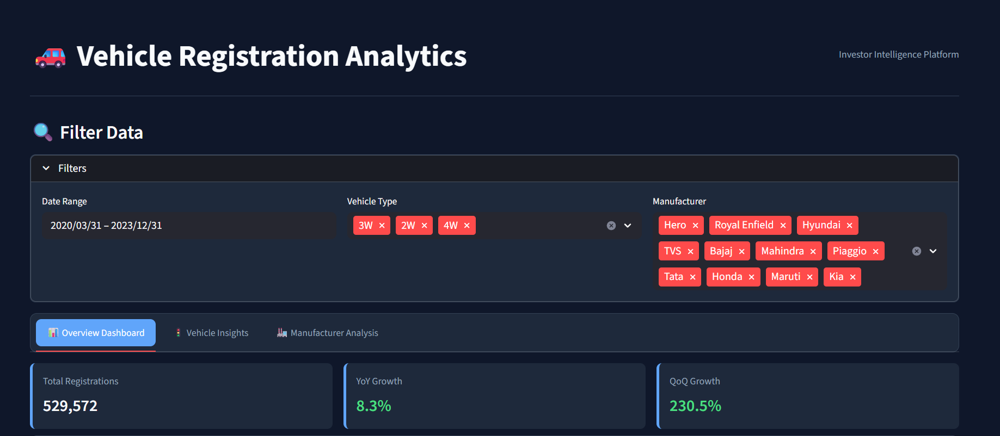
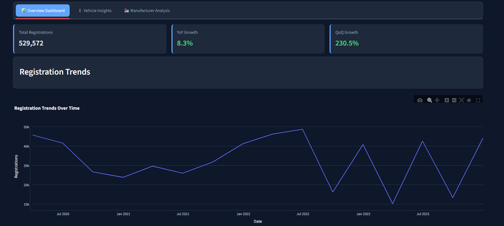
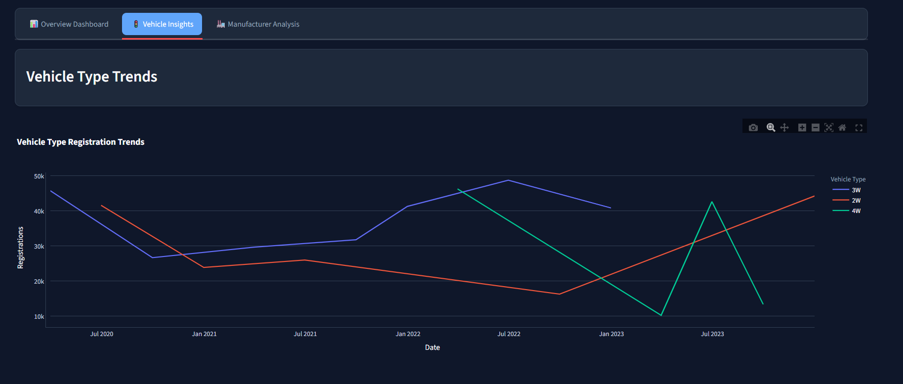
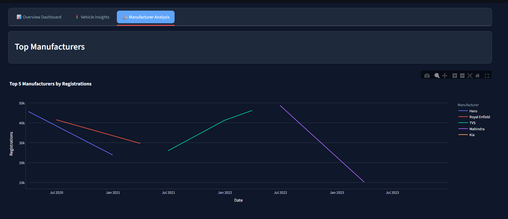

# Vahan Dashboard

A web-based dashboard for visualizing **vehicle registration data** in India, based on the **Vahan** portal.  
This project allows users to interact with charts, graphs, and tables that display detailed registration statistics in a clean and user-friendly interface.

## 📌 Features
- **Live Data Fetching** from the Vahan portal.
- **Interactive Charts & Graphs** for better visualization.
- **Search & Filter** options for specific states, RTOs, or time ranges.
- **Tabular Data Display** with pagination.
- **Responsive Design** for desktop and mobile views.

## 🛠️ Tech Stack
- **Frontend:** HTML, CSS, JavaScript (Vanilla / Framework if used)
- **Backend:** Python (Requests, BeautifulSoup, Flask/FastAPI if applicable)
- **Data Processing:** Pandas, JSON
- **Visualization:** Chart.js / Plotly.js / Any chart library you used
- **Data Source:** [Vahan Dashboard](https://vahan.parivahan.gov.in/vahan4dashboard/)

## 📂 Project Structure

Vahan_Dashboard/
│── vahan_dashboard # Source code files
    │── analysis.py
    │── dashboard.py
    │── scraper.py
│──.gitignore
│── requirements.txt # Python dependencies
│── README.md # Project documentation


## 🚀 Installation & Setup
1. **Clone the repository**
   ```bash
   git clone https://github.com/dhruvikmodi23/Vahan_Dashboard.git

 2. **Create virtual environment**
    ```bash 
    python -m venv virtual

 3. **Activate virtual environment(For Windows)**
    ```bash 
    virtual\Scripts\activate
 
 4. **Install dependencies**
    ```bash
    pip install -r requirements.txt

 5. **Run the application**
     ```bash
     cd vahan_dashboard
     streamlit run dashboard.py

# ScreenShots

## Filter Data


## Dashboard Overview


## Vehical Insights


## Manufacturer Analysis



📊 Usage

Open the app in your browser.

Select filters for State, RTO, Vehicle Class, and Date Range.

View visualizations and download data if available.

⚠️ Notes

This project scrapes public data from the Vahan portal.

The portal structure may change, requiring updates in the scraper code.

🤝 Contributing

Pull requests are welcome.
For major changes, please open an issue first to discuss what you would like to change.

📜 License

This project is licensed under the MIT License.


📩 Contact
For any queries, reach out at dhruvikmodi23@gmail.com or create an issue in the repository.
    
 


